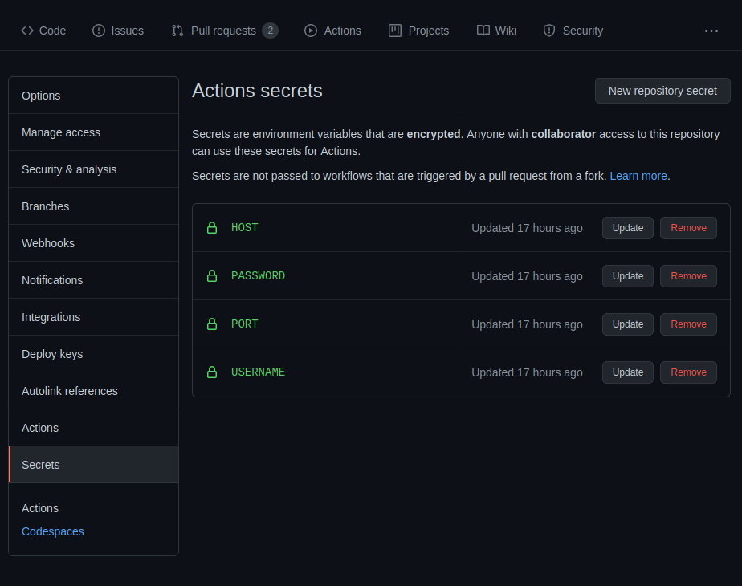

# LPCVC-Referee

The evaluation systems (referee) for the 2020 and 2021 Low Power Computer Vision Challenge.


## Server File Structure

```.
Home Directory
│
├─── referee [MUST BE CALLED referee]
│    ├── source_code [This Repository]
│    ├── queue [Location of Queue] 
│    └── referee.environment [Location to store enivronment variables]
│
├─── website_directory 
│    ├─── results 
│    └─── submissions 
│
├── test_data [Location of Data Source -> Ground Truths etc..] 
```

### Content that goes inside referee.environment file

```bash
WORKING_DIRECTORY="Working Directory aka Location of referee directory (as shown above)"
LPCVC_SUBMISSION_DIR="Location of Submissions"
LPCVC_TEST_VIDEOS="video1.mp4 video2.mp4 etc.."
LPCVC_TEST_DATA_DIR="Location of your Data Bank (sources, groundtruths, correct)"
LPCVC_PI_SCRIPTS_DIR="{Source Code Location}/scripts/pi_scripts"
LPCVC_PI_USER="username@[local ipv4 address]"
LPCVC_PI_PASSWORD="Password to Raspberry Pi"
LPCVC_PI_TEST_DIR="Directory to Run Contestant Solution"
LPCVC_SITE="Location of 'website_directory'. Required for 'results' directory"
METER_CMD="Python Command with {} as parameters to run script from Meter to Raspberry Pi"
METER_CSV="Output from the meter."
```
All environment variables are used inside lpcvc/LPCVC2021/lpcvc_queue directory. I recommend looking through there, 
in addition, posting issues if you notice a major flaw.

## Required Hardware and Software

- Yokogawa WT310 Power Meter (discontinued, substitutable with
  the [WT310E](https://www.electro-meters.com/yokogawa/yokogawa-power-meters/wt300e/) model)
- Linux Server
    - LPCVC Referee (this repo)
- Windows Computer
    - [Yokogawa YKMUSB USB Driver](https://tmi.yokogawa.com/us/library/documents-downloads/software/usb-driver/)
    - [Microsoft Visual Studio](https://visualstudio.microsoft.com/downloads/)
    - [Python 3](https://www.python.org/downloads/windows/)
    -
  OpenSSH ([Windows 10](https://docs.microsoft.com/en-us/windows-server/administration/openssh/openssh_install_firstuse)
  , [before Windows 10](https://github.com/PowerShell/openssh-portable/releases))
    - [HELPS WT310 Controlling Program](https://github.com/anivegesana/WT310)
- Raspberry Pi 
    - [Fedora 32 Minimal](https://fedoraproject.org/wiki/Architectures/ARM/Raspberry_Pi)

## System Setup 

### Setting up the Yokogawa WT310 Power Meter

The power meter must be connected so that it can record the power consumption of the Pi.

### Setting up the Linux Server

Create a virtual environment for this repository and install the requirements from requirements.txt. Create a folder to
store the submission files and update the `SUBMISSION_DIR` variable of the lpcvc.py file in this repository. Create an
SSH key for the Linux Server using the ssh-keygen utility.

### Setting up the Windows Computer

After installing Microsoft Visual Studio and Python 3, open the HELPS WT310 Controlling Program solution and build the
solution. Update the locations of the Python binary and the Debug folder in the `METER_CMD` and `METER_CSV` variables of
the lpcvc.py file in this repository. Create another SSH key for the computer using the ssh-keygen.exe utility. Add the
Linux Server key to the authorized_keys file in the user/.ssh folder using the ssh-add.exe utility.

### Setting up the Raspberry Pi

Run the following commands on the Raspberry Pi.

```bash
sudo dnf update
sudo dnf install git cmake ninja-build clang unzip distcc python3-virtualenv python3-devel python3-opencv python-pillow gstreamer1-plugins-base gstreamer1-plugins-good
sudo reboot
```

Create a virtual environment for the solutions with the `--site-packages` option. Create an empty folder for the testing
of the submissions. Update the `PI_TEST_DIR` variable of the lpcvc.py file in this repository. Create yet another SSH
key for the Linux Server using the ssh-keygen utility. Add all three keys to the authorized_keys file in the ~/.ssh
folder using the ssh-add utility.
__DO NOT__ add the Pi's key to the other two machines. Doing so is a security risk.

## Using the Referee (2021)

### Installing Program to Score Submission

You need to clone this repository, and then run the following command.

```bash
python3 setup.py install --user

# To Install Queue
cd [source code]/scripts/server_scripts
./service.sh
```

This will make the script 'test-solution' available to you in any working directory. As a result, you can run the
program from any directory without the need to pinpoint the location of the script.

```bash
test-solution [-t Threshold] [Submitted CSV file] [Correct CSV File]
```

Threshold: Integer that corresponds to the number of frames away the submitted input answer can be from the correct input
when tracking when a ball is caught. This is an optional argument, and the default is 10. Submitted CSV File: Result CSV
file from submission. Correct CSV File: The Ground Truth CSV file.

The end goal is for the Submitted CSV File to closely relate to the Correct CSV File in order to detect the accuracy of
your solution.

#### [How The Score is Determined](lpcvc/LPCVC2021/scoring/README.md)

## Using the Referee (2020)

### Starting the Referee Queue

```bash
systemctl start lpcvc.service --user
```

### Seeing the Logs Messages

```bash
systemctl status lpcvc.service --user
```

### Manually Enqueuing Submissions

```bash
touch queue/test.pyz
```
Make sure inside the "LPCVC_SUBMISSION_DIR", that there is a file called test.pyz that meets the requirements of running
the solution.

### Stopping the Referee Queue

```bash
systemctl stop lpcvc.service --user
```


### GitHub Actions [Optional]

The team uses GitHub Actions for automatic deployment to the server. This is done by creating a ssh
channel through GitHub, which as a result, run a command on the computer to automatically install. The username,
password, and port is encrypted, and no PR or Fork can trigger a run on the computer.

##### Setting up GitHub Action


This page is located under Settings, then Secrets.

You click on New repository secret, and enter the HOST (url to computer), username, password, and port (usually 22).


```
~/scripts/referee.sh
```

This script can be anything. For this purpose, it will run scripts inside the scripts directory in this repository.
