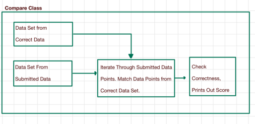
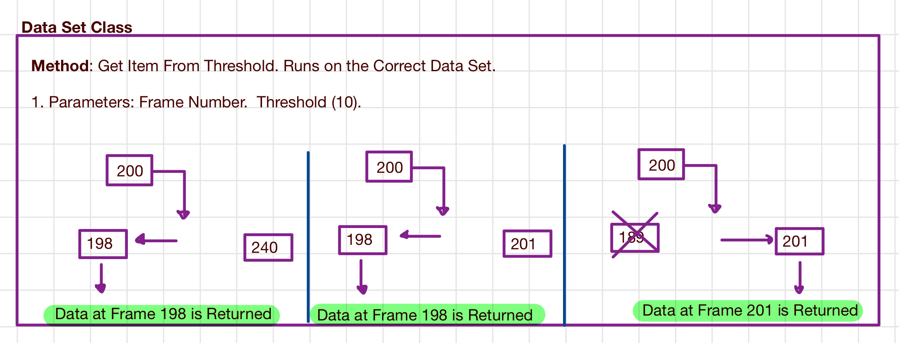
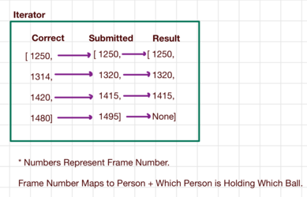
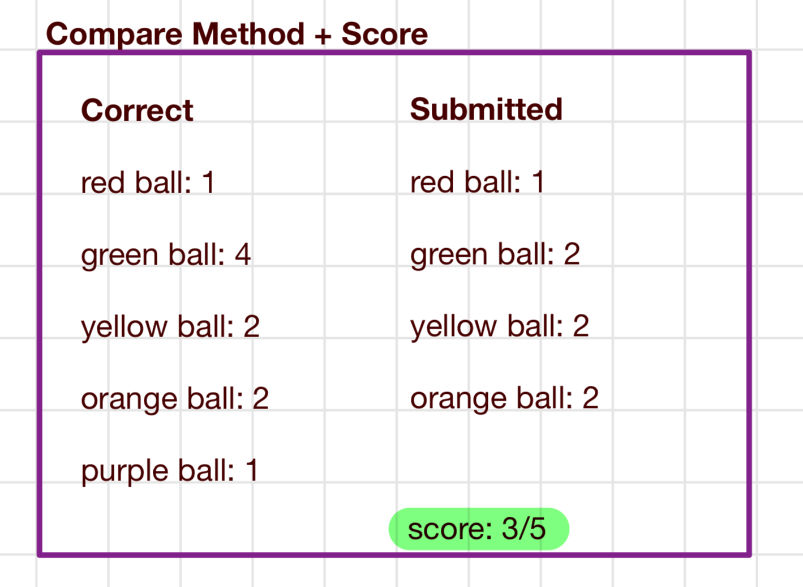

# Basic Overview of How Program Calculates Score

When given two csv files, it interpolates it into a DataSet Class, created inside data_set.py.
The feature of the data set class contains attributes that makes comparing the two data (submitted and correct)
easy when grading. When iterating through the correct data points, it will map which data points from submitted
closely match to the correct data points only based off frame number. After it completes the mapping, it then therefore
calculates the score based off of who is holding which ball at certain frame number.

# Determine Mapping from Submitted to Correct Data Point (Frame Number)

The Program will iterate through the correct data points. For each data point from correct, it will find the 
corresponding submitted data point based off of frame number. As from the diagram above, the program will always
favor the earlier frame than the later. So in the example above, if the threshold is 10, it will choose the frame on the
left that is within the threshold (10 frames away). So since, 198 (data point from submitted) is within 10 frames from 200 
(data point from correct), it will favor 198 even if the frame number on the right is closest. In addition, we ensure 
that there is a 1 to 1 mapping from correct to submitted, so once a frame from submitted is mapped to a frame in correct,
a frame from submitted cannot represent another frame in correct. The only time when the right side is favored is when 
the left end is out of bound from the threshold.

# Result After Completing Mapping

Once Mapping is done, it will create the result above. As noticed, the Result list will be the same length as Correct. 
However, it will store the data points from submitted that closely map to Correct. 
If there is no data point / frame from submitted , then the data point will be represented as None.  
Notice the data structures, where even though the diagram is being represented as numbers, the numbers 
represent who was carrying which ball from either submitted or correct. As for result, it represents data points from
Submitted. 

# Compare Method Per Data Point

After completing the mapping, it will look through data points from correct, and data point from result, and check
if the solution predicted who was carrying which ball correctly. For each frame, it will represent a score from 0 to 1
based off of how correct each frame is. 

# Final Score
Final Score = [(Summation of Score Per Frame From Enumerating Result and Solution) / (Number of Frames from Correct Data Set)] * 100
